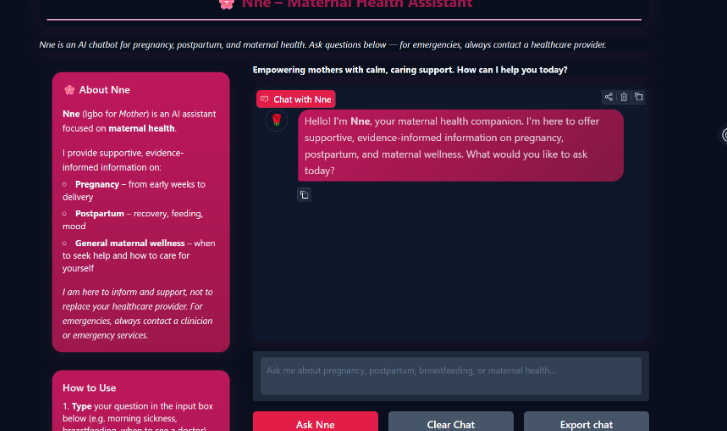
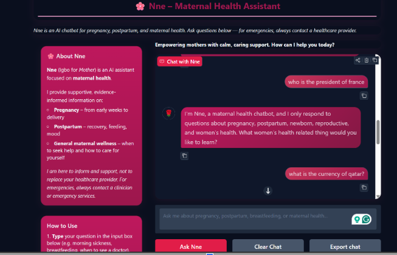

# Nne - Maternal Health QA Chatbot

**Nne** (Igbo for *Mother*) is a domain-specific maternal health chatbot that provides supportive, evidence-informed answers on pregnancy, postpartum care, breastfeeding, and maternal wellness. Built with a fine-tuned Gemma-2-2b-it LLM using LoRA and 4-bit quantisation, it acts as an always-available, empathetic first point of information for mothers and caregivers—not a replacement for clinical care, but a bridge to better-informed decisions and timely help-seeking.

### Screenshots

| Greeting | Clinical question | Medical question | Off-topic redirect |
|----------|-------------------|------------------|--------------------|
|  |  |  |  |

---

## Why Maternal Health as the Domain?

Maternal mortality remains a critical global challenge: roughly 800 women die every day from preventable pregnancy- and childbirth-related causes, with the vast majority in low-resource settings where access to timely clinical advice is limited. Barriers include lack of health information, limited access to services, and shortages of skilled health workers. As a result, many women navigate pregnancy and postpartum without reliable, timely support.

**Nne** addresses this gap by providing:

- **24/7 availability** — Like having a supportive midwife-style resource always on hand
- **Domain expertise** — Focused on pregnancy, postpartum, newborn, and women's health
- **Evidence-informed tone** — Supportive and clinically aware, with clear guidance on when to seek care
- **Domain guardrails** — Stays on-topic and redirects non–maternal-health questions
- **Risk awareness** — Trained to flag high-risk scenarios and encourage emergency care when appropriate

---

## Core Chatbot Features

### Web App

- **Hugging Face Spaces** — Deployed for global access with 24/7 availability
- **Real-time responses** — ~40–50 second generation on free CPU tier (tuned for conciseness)
- **Chat export** — One-click download of the conversation as JSON
- **Conversation flow** — Welcome message, clear chat, and simple input/output layout
- **Responsive layout** — Two-column design (About + How to Use sidebar, main chat area)

### Domain Intelligence

- **Keyword-based guardrails** — ~120 maternal health keywords; off-topic queries get a polite redirect
- **Dual-layer safety** — Keyword pre-filter plus system instruction so the model stays on-domain
- **Risk-aware replies** — Chain-of-thought style risk tags (e.g. high-risk → "seek urgent care")
- **Medical disclaimer** — Clear message that Nne informs and supports but does not replace a healthcare provider

---

## Key Achievements

### Training Performance

- **BLEU (base → fine-tuned):** 0.018 → 0.078 (**+326.6%** on 50 test samples)
- **ROUGE F1:** 0.152 → 0.250 (**+64.7%**)
- **Best experiment (Exp2):** +14.7% BLEU and +9.4% ROUGE F1 over baseline (Exp1)
- **Four experiments** — Systematic variation of learning rate, batch size, and epochs
- **Learning rate dominance** — Doubling LR (5e-5 → 1e-4) drove most of the gain; extra epochs at low LR added little

### Domain Intelligence

- **Domain detection** — Correct handling of maternal vs off-topic (e.g. cooking, general knowledge) in testing
- **Greeting and redirect** — Welcomes users and redirects off-topic questions with a fixed, on-brand message
- **Clinical focus** — Answers aligned with pregnancy, postpartum, breastfeeding, and maternal wellness

---

## Model Architecture

| Component | Detail |
|-----------|--------|
| **Base model** | `google/gemma-2-2b-it` (2.6B parameter instruction-tuned decoder) |
| **Fine-tuning** | PEFT / LoRA (r=8, alpha=16, dropout=0.05) with 4-bit NF4 quantisation (bitsandbytes) |
| **Trainable parameters** | ~0.5% of total |
| **Framework** | PyTorch, Hugging Face Transformers, PEFT |
| **Task** | Generative question answering (causal LM) |

**Architecture (Gemma-2-2b-it):**

- Decoder-only transformer, 256K SentencePiece vocabulary
- Context window: 8,192 tokens
- Training: max input 256, max target 512 tokens
- Best run: LR 1e-4, batch 4, 2 epochs, effective batch 8 with gradient accumulation

---

## About the Dataset

**Sources:** Three complementary medical/health sources were combined and then filtered to maternal health:

- **Medical Meadow** (~4,800 retained) — Factual clinical Q&A (conditions, symptoms, treatments)
- **Mental Health Counseling** (~900) — Empathetic counselor–patient style (e.g. perinatal mood, anxiety)
- **ChatDoctor** (~6,000 cap) — Realistic patient–doctor dialogue; only maternal-health-relevant exchanges kept

**Preprocessing:** Domain keyword filter → noise removal (greetings, URLs, HTML) → quality filter (min lengths) → deduplication (2,154 removed) → chain-of-thought risk tags (`<thinking>Risk: High/Low...</thinking>`) → JSONL with `instruction`, `input`, `output`.

**Final dataset:** 11,674 instruction–input–output triples; 80% train / 10% val / 10% test.

### Dataset Structure

Each JSONL line has:

| Field | Description |
|-------|-------------|
| `instruction` | System prompt defining Nne's persona and scope |
| `input` | User question (maternal health) |
| `output` | Model response: `<thinking>Risk: ...</thinking>` + answer |

### Dataset Files

- `data/dataset/nne_mixed_train_v2.jsonl` — Full preprocessed dataset (11,674 examples)
- Splits are produced in the notebook (train/val/test from the above file).

---

## Model Analysis (Gemma-2-2b-it) & Experiments

A **generative QA** setup was chosen so the assistant can answer in its own words and cover cases where the answer is not literally in a single passage. **Gemma-2-2b-it** was chosen for its instruction-following base, 2.6B size (trainable on a single A100), and good Hugging Face integration (Transformers, PEFT, bitsandbytes).

**Why LoRA:** Full fine-tuning would need >40 GB GPU memory and risk catastrophic forgetting. LoRA with 4-bit quantisation keeps usage at ~8–12 GB and preserves general language ability while specialising for maternal health.

### Experiment Table

| Experiment | LR | Batch | Epochs | Train Loss | Val Loss | BLEU | ROUGE F1 | Time (s) |
|------------|-----|-------|--------|------------|----------|------|----------|----------|
| Exp1 (Baseline) | 5e-5 | 4 | 1 | 1.485 | 1.434 | 0.144 | 0.295 | 603 |
| **Exp2* (High LR)** | **1e-4** | **4** | **2** | **1.463** | **1.477** | **0.165** | **0.323** | 2,306 |
| Exp3 (More Epochs) | 5e-5 | 2 | 3 | 1.558 | 1.445 | 0.145 | 0.296 | 3,710 |
| Exp4 (1 Epoch) | 5e-5 | 2 | 1 | 1.578 | 1.477 | 0.141 | 0.285 | 1,231 |

\* **Exp2** selected for deployment (best BLEU/ROUGE; +14.7% BLEU over baseline).

### Optimal Configuration (Exp2)

- **Learning rate:** 1e-4
- **Batch size:** 4 (gradient accumulation 4 → effective 8)
- **Epochs:** 2
- **LoRA:** r=8, alpha=16, dropout=0.05; target: attention Q,K,V,O
- **Inference:** `MAX_NEW_TOKENS=64` (configurable via env) for concise, faster responses on CPU

---

## Domain Specificity Handling

- **Maternal keywords** — Large curated list covering pregnancy, labour, postpartum, breastfeeding, newborn, reproductive and women's health, mental health, anatomy, conditions, etc.
- **Off-topic detection** — If the user message contains no maternal keyword, the model is not called; a fixed redirect message is returned (saves ~40–50 s per off-topic query).
- **System instruction** — Explicit instruction that Nne answers only maternal health questions and politely redirects others.
- **Tested behaviours** — Maternal questions answered; off-topic (e.g. "How do I cook pasta?") redirected; greetings and empty input handled.

---

## Technologies Used

**ML/AI stack:**

- **Model:** Gemma-2-2b-it (Hugging Face)
- **Framework:** PyTorch, Transformers, PEFT, bitsandbytes
- **Training:** Modal Cloud (A100 40 GB) or Google Colab
- **Tokenisation:** SentencePiece (256K), via model tokeniser
- **Evaluation:** BLEU (nltk), ROUGE-L F1 (rouge-score), perplexity

**Deployment:**

- **Frontend:** Gradio 4.x (Blocks API), custom CSS, pink/rose theme
- **Backend:** PyTorch, Transformers, PEFT
- **Hosting:** Hugging Face Spaces (CPU)
- **Model storage:** Hugging Face Hub (adapter only)

---

## Steps to Run the Chatbot

### 1. Try the live app

Visit **[Nne on Hugging Face Spaces](https://huggingface.co/spaces/TheodoraE/nne-llm-maternal-health-chatbot)** — no local setup required.

### 2. Run locally

```bash
git clone https://github.com/TheodoraE/Nne--Maternal-Health-Assistant.git
cd Nne--Maternal-Health-Assistant

python -m venv .venv
source .venv/bin/activate   # Windows: .venv\Scripts\activate
pip install -r requirements.txt
```

Create a `.env` file with your Hugging Face token (required for gated Gemma):

```
HF_TOKEN=hf_YourTokenHere
```

Then:

```bash
python nne_chatbot_app.py
```

For a public link (e.g. for recording a demo): `GRADIO_SHARE=1 python nne_chatbot_app.py`

### 3. Use the model directly

```python
from transformers import AutoTokenizer, AutoModelForCausalLM
from peft import PeftModel
import torch

tokenizer = AutoTokenizer.from_pretrained("TheodoraE/nne-maternal-health-adapter")
base_model = AutoModelForCausalLM.from_pretrained(
    "google/gemma-2-2b-it",
    torch_dtype=torch.float16,
    device_map="auto",
)
model = PeftModel.from_pretrained(base_model, "TheodoraE/nne-maternal-health-adapter")

def ask_nne(question):
    prompt = f"You are Nne, a wise and empathetic midwife assistant.\n\nInput: {question}\n\nOutput:"
    inputs = tokenizer(prompt, return_tensors="pt", truncation=True, max_length=512).to(model.device)
    with torch.no_grad():
        out = model.generate(**inputs, max_new_tokens=64, do_sample=False, pad_token_id=tokenizer.pad_token_id)
    return tokenizer.decode(out[0][inputs["input_ids"].shape[1]:], skip_special_tokens=True)

print(ask_nne("What are signs of preeclampsia?"))
```

### 4. Full pipeline (data + training + eval)

- Open `nne-llm-fine-tuning-pipeline.ipynb` in **Google Colab** (T4 GPU) or run on **Modal** (`modal run modal_jupyter.py`).
- The notebook runs end-to-end: load/preprocess data, train LoRA, evaluate (BLEU, ROUGE, perplexity), and compare base vs fine-tuned.
- Ensure `data/dataset/nne_mixed_train_v2.jsonl` is present (or run the notebook from the start to generate it).

---

## Performance Metrics

**Base vs fine-tuned (50 test samples):**

| Model | BLEU | ROUGE F1 |
|-------|------|----------|
| Base Gemma-2-2b-it | 0.018 | 0.152 |
| Fine-tuned Nne (Exp2) | 0.078 | 0.250 |
| **Improvement** | **+326.6%** | **+64.7%** |

**Across experiments (vs Exp1 baseline):** Exp2 gives +14.7% BLEU and +9.4% ROUGE F1; Exp3 and Exp4 are close to or below baseline, supporting the finding that learning rate matters more than extra epochs for this LoRA setup.

---

## Conversation Examples

- **Maternal health query** — e.g. "What is a contraction?" → Focused, clinically relevant explanation.
- **Off-topic** — e.g. "Who is the president of France?" → Polite redirect to maternal health.
- **Greeting** — "Hello!" → Welcome and invitation to ask about pregnancy, postpartum, or maternal wellness.

**How to add screenshots:**

1. **Store images in the repo** (recommended for GitHub):
   - Save screenshots in the `docs/images/` folder (e.g. `chatbot-ui.png`, `example-maternal.png`).
   - In the README, reference them with: ``.
   - Alt text is the short description shown if the image fails to load (e.g. "Nne chatbot interface").

2. **Or use external URLs** (e.g. imgur, HF Space screenshot link):
   - Use the same Markdown: ``.

3. **Taking the screenshots:**
   - Open your [Hugging Face Space](https://huggingface.co/spaces/TheodoraE/nne-llm-maternal-health-chatbot), use **Win + Shift + S** (Windows) or **Cmd + Shift + 4** (Mac) to capture the window, then save as PNG in `docs/images/`.
   - Name files to match the table in the Screenshots section above (`chatbot-ui.png`, `example-maternal.png`, `example-off-topic.png`) so they display without changing the README.

---

## Deployment

| Resource | Link |
|----------|------|
| **Live demo** | [Hugging Face Space](https://huggingface.co/spaces/TheodoraE/nne-llm-maternal-health-chatbot) |
| **Adapter model** | [Hugging Face Hub](https://huggingface.co/TheodoraE/nne-maternal-health-adapter) |
| **GitHub** | [Nne--Maternal-Health-Assistant](https://github.com/1heodora-e/Nne--Maternal-Health-Assistant) |

**Demo video:** https://youtu.be/PFYk-sn3h5w
---

## About

Built as an individual project on domain-specific assistants via LLM fine-tuning — using a pre-trained Hugging Face LLM (Gemma), parameter-efficient fine-tuning (LoRA), and deployment (Gradio on Hugging Face Spaces) for maternal health education and support.

**Author:** Theodora Egbunike — February 2026
**Facilitator:** Ms Samiratu Ntohsi
